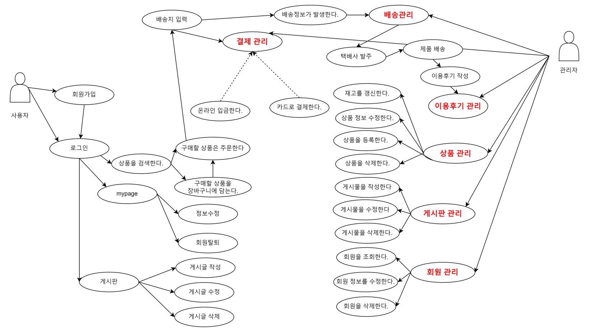
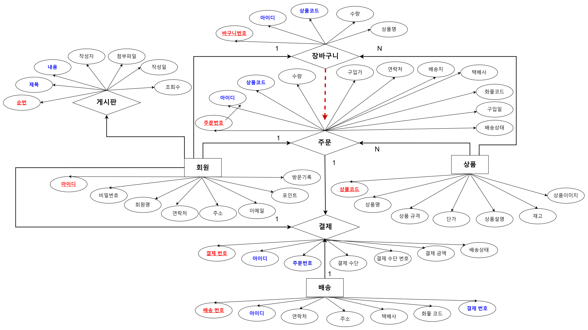
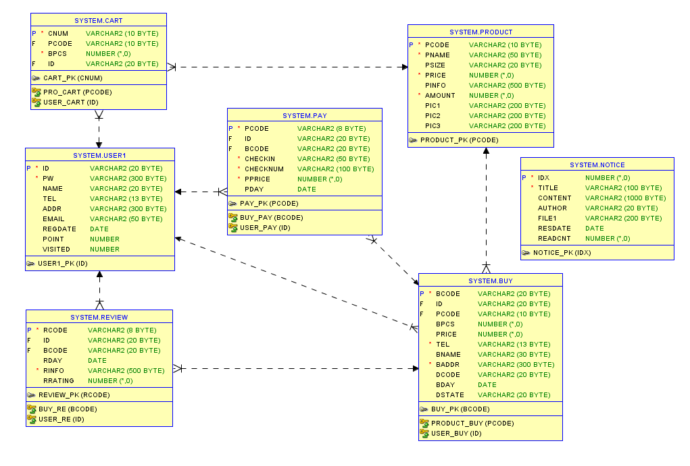
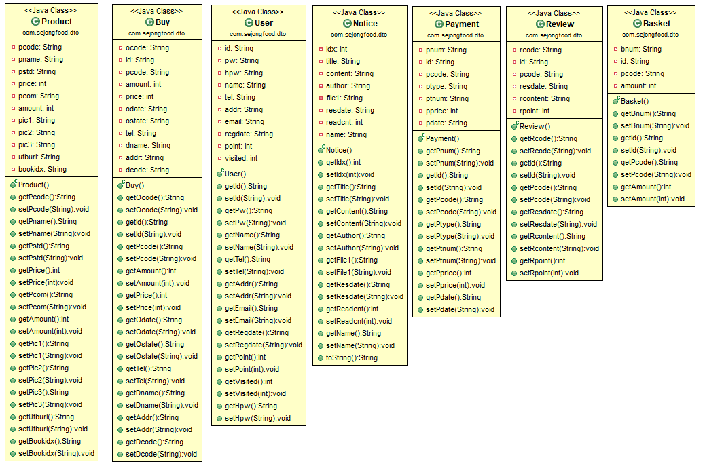
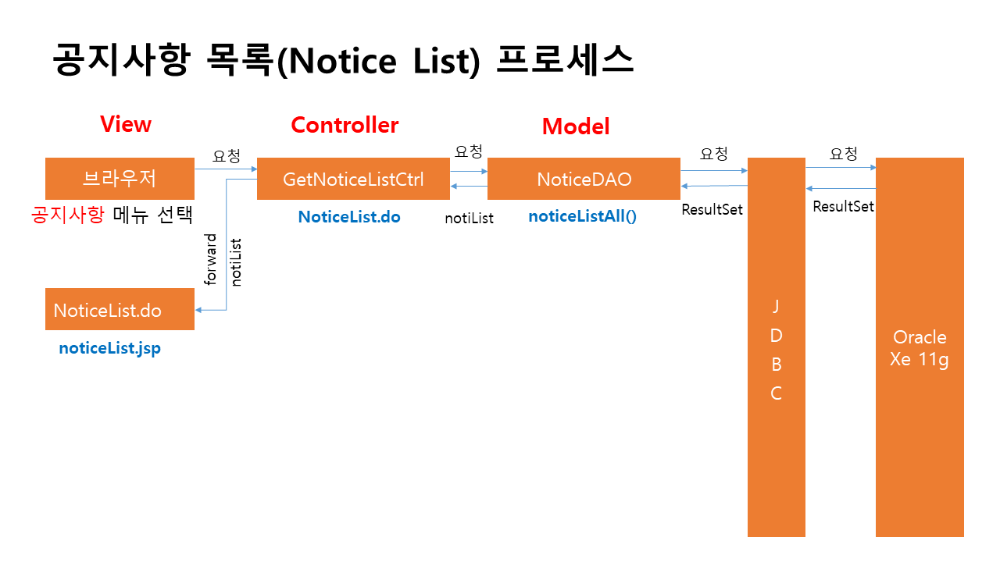
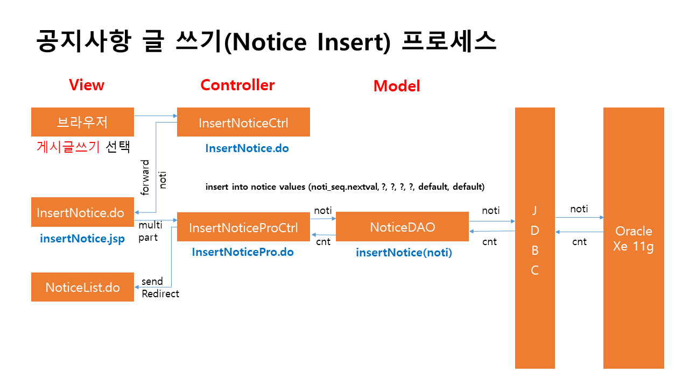
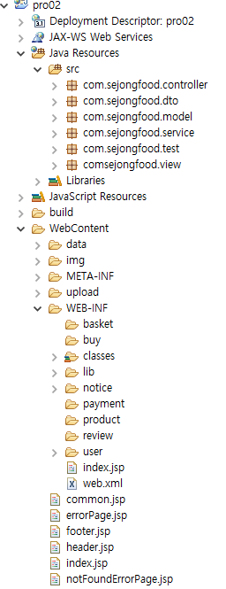

# 개발환경 구축

## 프로젝트 명 : 세종푸드 쇼핑몰
## 프로젝트 기간 : 2023. 05. 03. ~ 05. 16.
## 프로젝트 참여 : 김세종
## 자바버전 : jdk 1.8
## 자바스크립트버전 : 1.0
## 다이나믹 웹 모듈 : 3.1
## 사용 DBMS : Oracle 11g xe
## 자바 사용 라이브러리 : cypto, json, cos, commons, mail
## CSS 프레임워크 : 부트스트랩 3.3.2
## 자바스크립트 플러그인 : JQuery
## 자바스크립트 api : daum 주소 api, json 데이터처리, iamport 결제 api
## 프로젝트 데이터 처리 패턴 : MVC2(view -> controller -> model -> controller -> view)
## 프로젝트 주요기능 : 회원, 공지사항, 질문 및 답변, 이용후기, 장바구니, 판매, 배송, 결제 기능 등
## 프로젝트 특이사항
- 회원가입 시 중복 체크는 json을 활용하여 별도의 팝업 창이 없이 현재 창에서 구현
- 회원 가입시 주소의 입력은 daum 주소 api를 활용하여 주소를 전달
- 회원의 비밀번호는 md5, sha256, aes256 등으로 암호화 하여 처리
- 회원 가입 후에는 네이버 메일 서버 또는 Gmail 메일 서버로 가입 축하 이메일 발송
- 공지사항은 파일 첨부(업로드) 기능을 함께 구현
- 공지사항 전체 목록의 페이징 처리와 검색 기능 구현
- 공지사항 글의 상세보기 화면에서 해당 게시된 공지 중에서 파일 다운로드 기능 추가
- 결제 기능은 결제 api 기능을 활용하여 다양한 방법으로 결제 테스트가 가능
- 배송 시스템은 CJ 대한통운, 롯데택배, 우체국택배, 로젠택배, 한진택배, CU편의점 택배, EMS택배, 경동택배 등으로 한다.
- 배송 시스템으 배송상태는 회원이 결제 후에 배송전으로 관리자가 배송을 등록하면, 배송중 또는 배송완료로 처리
- 이용후기는 댓글과 별점 등으로 구성하여 게시될 수 있도록 처리

# 프로젝트 설계
## 개념적 설계 
- 유스케이스

 
## 논리적 설계 엑셀
- 정보공학적 ERD

## 물리적 설계
- 데이터 베이스 ERD

## 클래스 설계
- 클래스 다이어그램

## 시퀀스 설계
- 시퀀스 설명

젤 마지막에 이클립스 pro02 폴더 파일 생성부분 캡쳐 후 업로드->

# 프로젝트 구성
